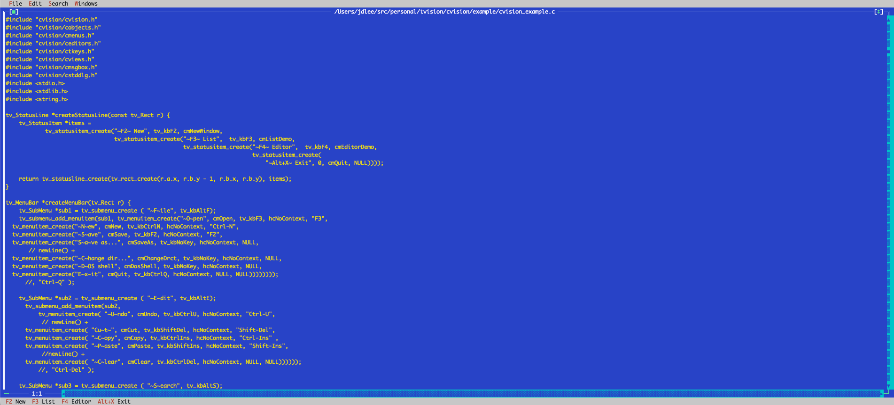

= CVision

CVision is an experimental C wrapper for the https://github.com/magiblot/tvision/[Turbo Vision port by magiblot].
The goal is to create a number of C functions that wrap/expose the C++ APIs so that they can ultimately be used
from Java source. The C++ ABI is, apparently, complex and unstable enough to make it difficult/impossible/unappealing
to the Java platform team (and others, of course). C, though, has a stable enough ABI to make things like the
https://docs.oracle.com/en/java/javase/21/core/foreign-function-and-memory-api.html[Foreign Function and Memory API].
In theory, once I have a C library that is flexible enough, I can create a Java API to wrap it, and then make cool
windowed, mouse-powered TUIs. :)  In theory.

This project is the latest effort in a decades-long desire to be able to write Turbo Vision applications in Java.
There are, perhaps, better avenues for this, and probably even better libraries, but this part nostalgia and part
education. So enjoy this along with me, or don't. I'm having fun with it at the moment, and that's good enough for
me. :)

